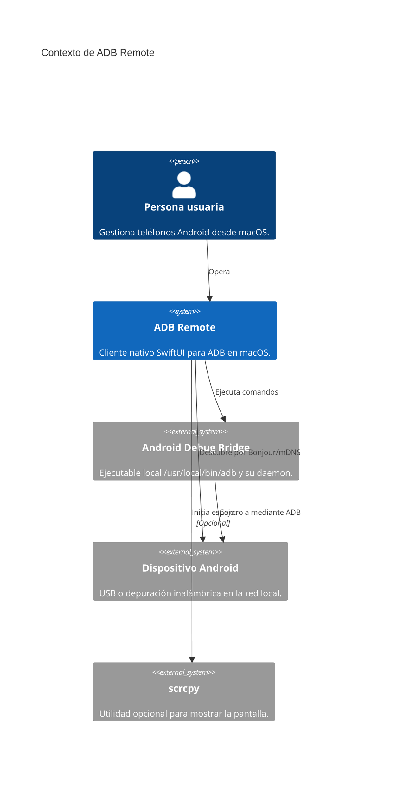
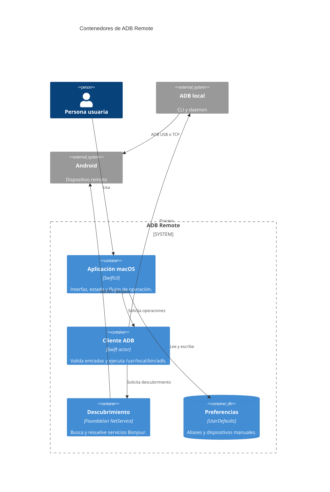

# Arquitectura C4

Estado documentado: commit `cd6827e` (`first commit`).

## Nivel 1: contexto



La app no incluye ADB ni `scrcpy`; depende de instalaciones locales ya existentes. El acceso a la red local se solicita a macOS para descubrir dispositivos Android con Bonjour.

## Nivel 2: contenedores



## Nivel 3: componentes de la aplicación

```mermaid
flowchart LR
    App[ADBRemoteApp\nPunto de entrada] --> Content[ContentView\nLista y flujos de conexión]
    Content --> Detail[DeviceDetail\nAcciones por dispositivo]
    Content --> Store[DeviceStore\nEstado observable]
    Detail --> Store
    Store --> Client[ADBClient actor\nComandos y validación]
    Client --> Discovery[BonjourADBDiscovery\nServicios mDNS]
    Client --> CLI[/usr/local/bin/adb]
    Store --> Defaults[(UserDefaults)]
    Client --> Models[Models\nDispositivos, apps y errores]
    Store --> Models
```

| Componente | Responsabilidad |
| --- | --- |
| `ADBRemoteApp` | Crea el almacén, carga inicial y atajo Cmd-R. |
| `ContentView` | Lista dispositivos, ofrece emparejamiento, conexión y alta manual. |
| `DeviceDetail` | Presenta operaciones remotas, APK, aplicaciones y puertos. |
| `DeviceStore` | Coordina UI asíncrona, selección, mensajes y persistencia. |
| `ADBClient` | Serializa la ejecución de ADB, valida entradas y traduce errores. |
| `BonjourADBDiscovery` | Descubre `_adb-tls-connect._tcp` sin depender del daemon ADB. |
| `Models` | Representa y analiza respuestas ADB y entidades de interfaz. |

## Decisiones y límites

- `ADBClient` es un `actor`, por lo que las operaciones sobre procesos ADB se aíslan del estado de UI.
- `DeviceStore` se ejecuta en `MainActor` y es la única fuente observable para las vistas.
- El descubrimiento Bonjour se intenta primero; `adb mdns services` se usa solo como alternativa.
- Ante "No route to host", la conexión reinicia una vez el servidor ADB y reintenta.
- No hay backend, base de datos remota ni telemetría en el alcance actual.
